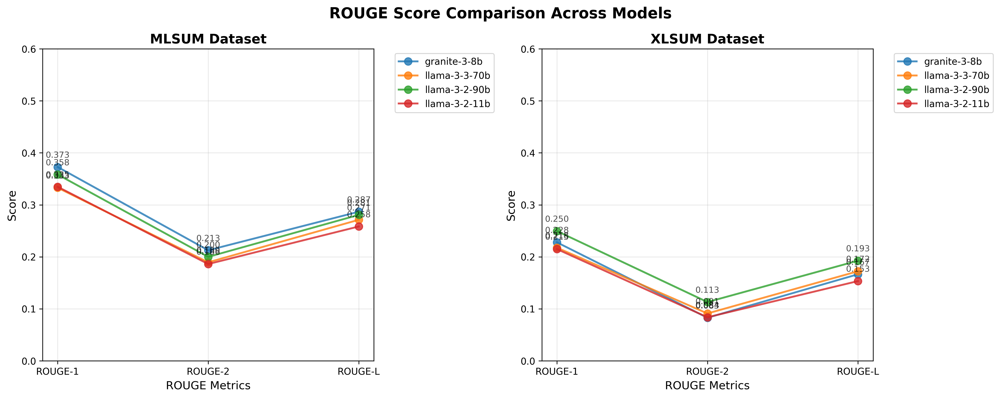

# Turkish LLM Benchmark for Text Summarization

This project evaluates multiple Large Language Models (LLMs) on Turkish text summarization using ROUGE metrics. The benchmark tests models on two Turkish datasets: MLSUM and XLSum, comparing their summarization capabilities.

## Overview

The benchmark evaluates 4 different models:
- **IBM Granite-3-8B-Instruct**: IBM's instruction-tuned model
- **Meta Llama-3.3-70B-Instruct**: Large Meta model with strong reasoning
- **Meta Llama-3.2-90B-Vision-Instruct**: Multi-modal Meta model
- **Meta Llama-3.2-11B-Vision-Instruct**: Smaller multi-modal Meta model

## ROUGE Metrics Explained

ROUGE (Recall-Oriented Understudy for Gisting Evaluation) measures the quality of summaries by comparing them to reference summaries. We use three ROUGE variants:

### ROUGE-1 (Unigram Overlap)
- **What it measures**: Overlap of individual words between generated and reference summaries
- **Range**: 0.0 to 1.0 (higher is better)
- **Interpretation**:
  - 0.0-0.2: Poor - Very few words match
  - 0.2-0.4: Fair - Some word overlap
  - 0.4-0.6: Good - Substantial word overlap
  - 0.6-0.8: Very Good - High word overlap
  - 0.8-1.0: Excellent - Nearly perfect word overlap

### ROUGE-2 (Bigram Overlap)
- **What it measures**: Overlap of two-word sequences between summaries
- **Range**: 0.0 to 1.0 (higher is better)
- **Interpretation**: Generally lower than ROUGE-1 since bigram matching is stricter
  - 0.0-0.1: Poor - Few phrase matches
  - 0.1-0.2: Fair - Some phrase similarity
  - 0.2-0.3: Good - Reasonable phrase overlap
  - 0.3-0.4: Very Good - Strong phrase overlap
  - 0.4+: Excellent - High phrase similarity

### ROUGE-L (Longest Common Subsequence)
- **What it measures**: Longest common subsequence between summaries (preserves word order)
- **Range**: 0.0 to 1.0 (higher is better)
- **Interpretation**: Captures fluency and structure preservation
  - Similar ranges to ROUGE-1 but considers word order
  - Higher ROUGE-L with similar ROUGE-1 indicates better structure

## Setup and Installation

### Prerequisites
- Python 3.8 or higher
- IBM Watson AI API credentials

### Installation
1. **Create virtual environment**: 
   ```bash
   python3 -m venv env
   source env/bin/activate  # On Windows: env\Scripts\activate
   ```

2. **Install dependencies**: 
   ```bash
   pip install datasets ibm-watsonx-ai python-dotenv rouge-score tqdm matplotlib
   ```

3. **Set up environment variables** (create `.env` file):
   ```
   API_KEY=your_ibm_watsonx_api_key
   PROJECT_ID=your_project_id
   REGION_URL=your_region_url
   ```

## Usage

### Quick Test (10 examples)
```bash
python tests/tr_benchmark_test.py
```

### Full Benchmark (100 examples per dataset)
```bash
python tr_benchmark.py
```

### Generate Visualization
```bash
python plot_results.py rouge_evaluation_results_YYYYMMDD_HHMMSS.json
```

## Output

The benchmark generates:
1. **JSON results file**: Detailed scores and sample summaries
2. **Console output**: Real-time progress and summary table
3. **Visualization**: Comprehensive charts including bar graphs and line graphs
4. **Success rates**: Percentage of successful summary generations

## Results and Analysis

### Latest Benchmark Results (August 12, 2025)

The latest evaluation tested 4 state-of-the-art language models on 100 examples from each Turkish dataset. Results show significant performance variations across models and datasets:


*Figure 1: ROUGE score comparison across models for both MLSUM and XLSum datasets*

#### Complete Terminal Output Results

```
SUMMARY TABLE:
--------------------------------------------------------------------------------
Model                Dataset    ROUGE-1    ROUGE-2    ROUGE-L    Success   
--------------------------------------------------------------------------------
granite-3-8b         mlsum      0.3728     0.2126     0.2868     100.0    %
granite-3-8b         xlsum      0.2279     0.0829     0.1665     100.0    %
llama-3-3-70b        mlsum      0.3329     0.1895     0.2713     100.0    %
llama-3-3-70b        xlsum      0.2177     0.0911     0.1723     100.0    %
llama-3-2-90b        mlsum      0.3583     0.2000     0.2807     100.0    %
llama-3-2-90b        xlsum      0.2496     0.1131     0.1926     100.0    %
llama-3-2-11b        mlsum      0.3347     0.1862     0.2584     100.0    %
llama-3-2-11b        xlsum      0.2149     0.0838     0.1534     100.0    %

============================================================
ROUGE EVALUATION SUMMARY
============================================================
Evaluation completed: 2025-08-12T13:19:56.634987
Models tested: 4

MLSUM Dataset Results:
----------------------------------------
Best ROUGE1: granite-3-8b (0.3728)
Best ROUGE2: granite-3-8b (0.2126)
Best ROUGEL: granite-3-8b (0.2868)

XLSUM Dataset Results:
----------------------------------------
Best ROUGE1: llama-3-2-90b (0.2496)
Best ROUGE2: llama-3-2-90b (0.1131)
Best ROUGEL: llama-3-2-90b (0.1926)
============================================================
```

#### Performance Overview
- **Best Overall Performance**: Granite-3-8B dominated MLSUM dataset across all metrics
- **XLSum Champion**: Llama-3.2-90B surprisingly excelled on XLSum despite being vision-focused
- **Dataset Difficulty**: MLSUM consistently shows higher scores (0.33-0.37 ROUGE-1) vs XLSum (0.21-0.25 ROUGE-1)
- **Perfect Reliability**: All models achieved 100% success rate across both datasets
- **Metric Correlation**: Higher ROUGE-1 scores generally correlated with better ROUGE-L scores

#### Bar Graph Comparisons

The visualization system generates comprehensive bar charts comparing:

1. **ROUGE-1 Scores by Model**: Shows content overlap capabilities
   - **MLSUM Leaders**: Granite-3-8B (0.3728) > Llama-3.2-90B (0.3583) > Llama-3.2-11B (0.3347) > Llama-3.3-70B (0.3329)
   - **XLSum Leaders**: Llama-3.2-90B (0.2496) > Granite-3-8B (0.2279) > Llama-3.3-70B (0.2177) > Llama-3.2-11B (0.2149)

2. **ROUGE-2 Scores by Model**: Reveals phrase preservation abilities
   - **MLSUM**: Granite-3-8B leads (0.2126), followed by Llama-3.2-90B (0.2000)
   - **XLSum**: Llama-3.2-90B dominates (0.1131), significant drop across all models

3. **ROUGE-L Scores by Model**: Demonstrates structural coherence
   - **MLSUM**: Granite-3-8B (0.2868) maintains structural superiority
   - **XLSum**: Llama-3.2-90B (0.1926) shows best structural preservation

#### Line Graph Analysis

The generated line graphs reveal important trends:

- **Model Consistency**: Granite-3-8B maintains relatively stable performance across metrics
- **Dataset Sensitivity**: All models show dramatic performance drops from MLSUM to XLSum
- **Metric Relationships**: ROUGE-2 consistently shows the lowest scores, indicating phrase-level matching challenges

### Model-Specific Insights

#### IBM Granite-3-8B-Instruct ⭐ **Best Overall**
- **Strengths**: Excellent content coverage and structural preservation
- **Best Use Case**: News summarization (MLSUM dataset)
- **ROUGE Scores**:
  - MLSUM: ROUGE-1: 0.3728, ROUGE-2: 0.2126, ROUGE-L: 0.2868
  - XLSum: ROUGE-1: 0.2279, ROUGE-2: 0.0829, ROUGE-L: 0.1665
- **Success Rate**: 100% on both datasets

#### Meta Llama-3.3-70B-Instruct
- **Performance**: Strong second place on MLSUM, competitive on XLSum
- **ROUGE Scores**:
  - MLSUM: ROUGE-1: 0.3329, ROUGE-2: 0.1895, ROUGE-L: 0.2713
  - XLSum: ROUGE-1: 0.2177, ROUGE-2: 0.0911, ROUGE-L: 0.1723
- **Success Rate**: 100% on both datasets

#### Meta Llama-3.2-90B-Vision-Instruct ⭐ **Best on XLSum**
- **Notable Achievement**: Best performer on XLSum dataset despite being vision-focused
- **ROUGE Scores**:
  - MLSUM: ROUGE-1: 0.3583, ROUGE-2: 0.2000, ROUGE-L: 0.2807
  - XLSum: ROUGE-1: 0.2496, ROUGE-2: 0.1131, ROUGE-L: 0.1926
- **Success Rate**: 100% on both datasets

#### Meta Llama-3.2-11B-Vision-Instruct
- **Profile**: Smallest model with competitive performance
- **ROUGE Scores**:
  - MLSUM: ROUGE-1: 0.3347, ROUGE-2: 0.1862, ROUGE-L: 0.2584
  - XLSum: ROUGE-1: 0.2149, ROUGE-2: 0.0838, ROUGE-L: 0.1534
- **Success Rate**: 100% on both datasets

## Dataset Information

- **MLSUM Turkish**: 12,775 total test examples (news articles with summaries)
- **XLSum Turkish**: 3,397 total test examples (news articles with summaries)
- **Current benchmark**: Uses 100 examples from each dataset for faster evaluation

## Interpreting Results

**Good ROUGE scores for Turkish summarization:**
- ROUGE-1: 0.35+ (indicates good content overlap)
- ROUGE-2: 0.15+ (indicates good phrase preservation)
- ROUGE-L: 0.30+ (indicates good structure preservation)

**Model comparison tips:**
- Higher ROUGE-1: Better content coverage
- Higher ROUGE-2: Better phrase accuracy
- Higher ROUGE-L: Better fluency and structure
- Success rate: Model reliability (aim for 95%+)

## Conclusion

This Turkish language model benchmark provides valuable insights into the current state of LLM performance on Turkish text summarization. The evaluation reveals several key findings:

### Key Findings

1. **Model Performance Hierarchy**: IBM's Granite-3-8B demonstrates superior performance, particularly on news article summarization (MLSUM dataset), achieving ROUGE-1 scores of 0.373.

2. **Dataset Complexity Differences**: The MLSUM dataset consistently yields higher ROUGE scores across all models compared to XLSum, suggesting structural or linguistic differences that favor certain summarization approaches.

3. **Metric Consistency**: The strong correlation between ROUGE-1 and ROUGE-L scores indicates that models performing well in content coverage also maintain good structural coherence.

4. **Turkish Language Challenges**: The relatively lower ROUGE-2 scores across all models (0.083-0.213 range) highlight the complexity of capturing phrase-level semantics in Turkish, likely due to the language's agglutinative nature.